# Wetrace Plus

**只做导入与分析的本地聊天记录工作台。** 不连接微信、不读取微信进程、不提取密钥、不解密任何数据库 ——
它只接收你用别的工具**已经导出**的 JSON / CSV / ZIP，把不同格式统一成一套分析模型，然后把这些记录变成可以翻、可以搜、可以看趋势的东西。

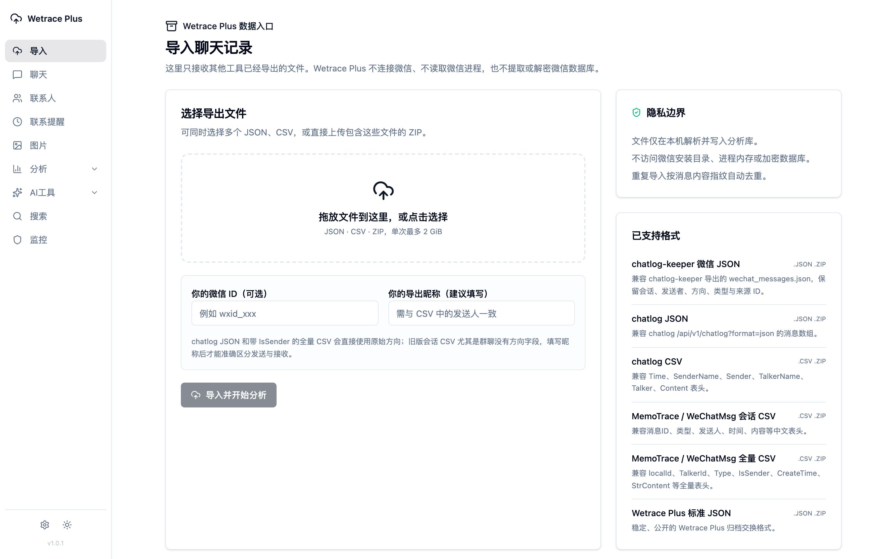

- 本地运行，默认只监听 `127.0.0.1:5200`
- 单文件 Go 后端 + React 前端（前端打包后 `go:embed` 进二进制）
- 25 万条演示数据从导入到出年度报告，约 30 秒

---

## 目录

- [这是什么](#这是什么)
- [法律与许可：先读这段](#法律与许可先读这段)
- [功能导览（含截图）](#功能导览含截图)
- [完整功能清单](#完整功能清单)
- [快速开始](#快速开始)
- [已支持的导入格式](#已支持的导入格式)
- [统计口径：几条容易错的地方](#统计口径几条容易错的地方)
- [项目结构](#项目结构)
- [文档](#文档)
- [开发](#开发)
- [数据与联网说明](#数据与联网说明)
- [致谢与免责声明](#致谢与免责声明)

---

## 这是什么

一台本地的「聊天记录分析工作台」。你已经有了导出文件（chatlog、chatlog-keeper、MemoTrace / WeChatMsg 等工具的产物），
把它拖进来，就能得到：聊天浏览与全文搜索、单会话的完整统计、年度社交报告、关系洞察与关系星图、词云、对话回放，
以及可选的 AI 摘要 / 待办提取 / 模拟对话。

和 Wetrace Pro 的差别只有一条，但很关键：

| | Wetrace Pro | **Wetrace Plus** |
| --- | --- | --- |
| 数据来源 | 自己定位、解密微信本地数据库 | **只接收别的工具导出的文件** |
| 微信进程 | 需要读取 | **完全不碰** |
| 数据库密钥 | 需要提取 | **不需要，也没有相关代码** |
| 附件（图片 / 语音 / 视频） | 能还原原文件 | 只保留占位与元数据 |
| 分析能力 | 一致 | 一致 |

> **隐私边界**：上传的文件只在本机临时目录解析，随后删除；导入生成的分析库保存在你指定的 `WORK_DIR`。
> Wetrace Plus 不会回头去访问微信安装目录、进程内存或加密数据库 ——
> 仓库里也**没有**任何提取密钥或解密微信文件的代码（v1.0.4 起连继承来的 `.dat` 解码器一并删除）。

---

## 法律与许可：先读这段

这个仓库**保持私有、不对外分发**，原因和代码质量无关：

1. **上游已被 DMCA 下架。** 本项目的分析框架继承自 [afumu/wetrace](https://github.com/afumu/wetrace)，
   该仓库连同 103 个 fork 已于 **2026-07-15 被 Tencent 依 DMCA §1201（规避技术保护措施）下架**
   （通知编号 `2026-07-13-wechat-4`）。被指控的功能正是「自动提取微信数据库密钥、解密并解析本地数据库」——
   **Wetrace Plus 已经把这部分整块移除**（这也是 Plus 存在的原因），但它继承的分析代码仍来自同一棵树。
2. **许可证链条不完整。** 更上游的 [sjzar/chatlog](https://github.com/sjzar/chatlog) **没有声明许可证**
   （= 保留所有权利），本仓库 `pkg/config` 等文件至今保留其作者的版权头。
3. 因此本仓库的 [`LICENSE`](LICENSE)（CC BY-NC-SA 4.0）**只覆盖本项目自己新写的部分**，
   不能视为对继承代码的授权。

**当前状态：仓库私有，仅供个人使用与学习。** 不发布二进制、不建 Release、不打 `v*` tag。
如果你拿到了这份代码，请不要公开再分发；也请只处理你有权使用的聊天记录。

---

## 功能导览（含截图）

> 以下截图全部来自 `scripts/gen_demo_import.py` 生成的**完全虚构**的演示数据
> （22 位联系人 + 5 个群 + 3 个公众号，2022-10 至今共 **251,887 条**消息），不含任何真实聊天内容。

### 导入：一次拖进去，自动识别格式

可以同时选多个 JSON / CSV，或直接上传保留了目录结构的 ZIP。重复导入是安全的 —— 系统按消息指纹去重，
并记录每次导入的文件哈希、格式、消息数和告警。页面顶部那张图就是它。

### 聊天浏览：和微信一样地翻，但可以搜

左边会话列表，右边消息气泡；语音显示时长、图片显示「附件未导入」的占位（导入文件里本来就没有原文件）。
顶部那条是收起状态的「今日报告」。

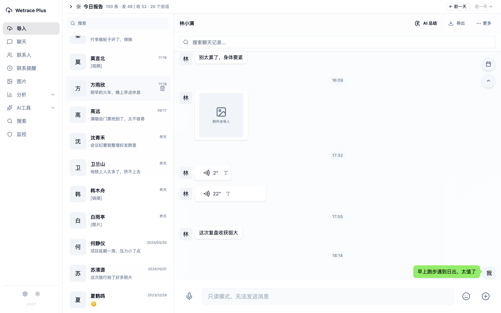

### 今日报告：今天和谁聊了多少

展开后是当天的收发比、字数、时段分布和「聊得最多」排行，可以按天前后翻。

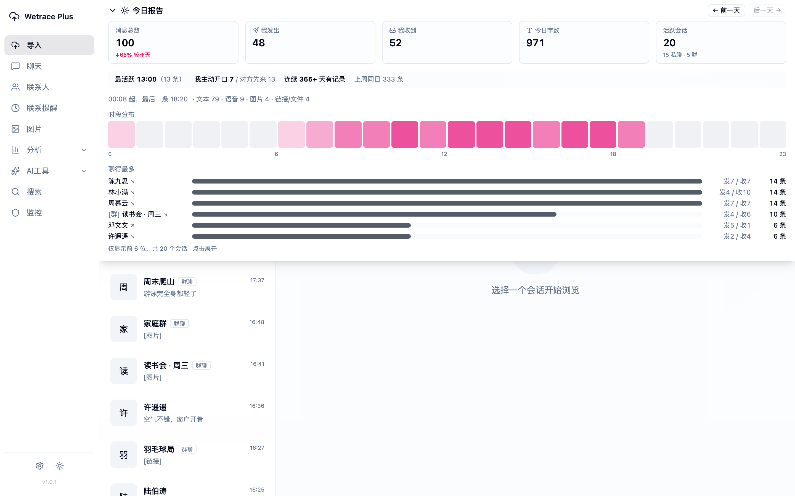

### 会话分析：单个会话的完整统计

总消息数、活跃天数、日历热力图、语音条数与总时长，以及「谁先开口 / 平均多久回」这类互动指标。

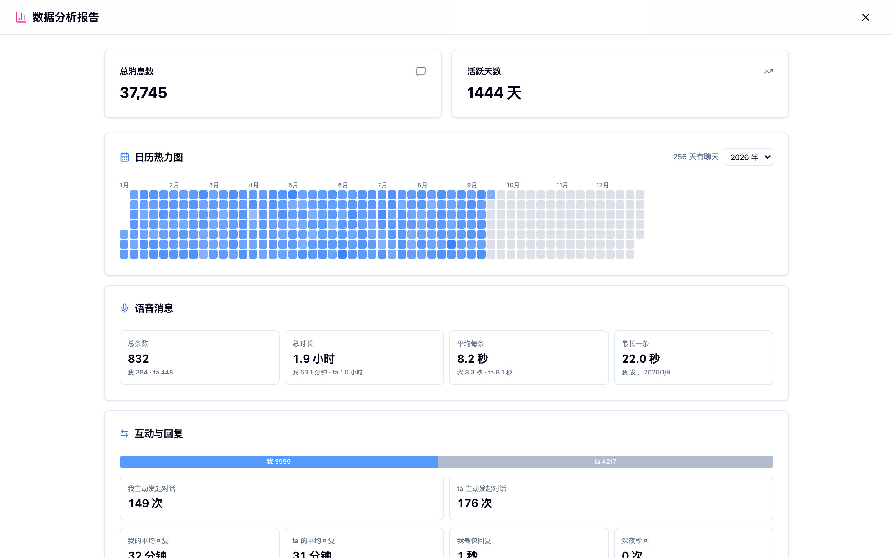

通话统计会区分**已接通 / 未接通 / 语音 / 视频**，并给出总时长、最长一次和平均时长；
回复速度统计会**剔除通话期间的消息**（通话里的来回不算回复）。

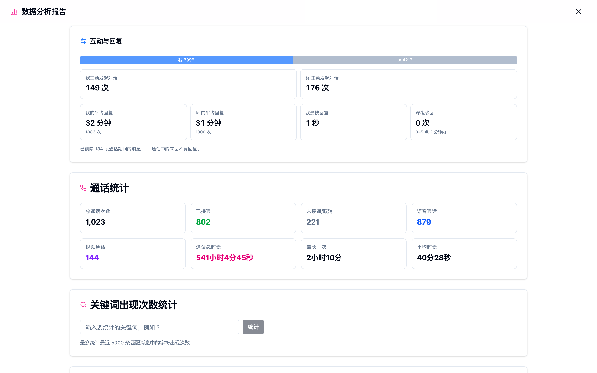

### 年度报告：一年的社交年鉴

概览、同比、年度亮点（最忙 / 最安静的一天、最长连续活跃、深夜消息、最早与最晚一条），
月度趋势会叠加往年同月均值作参照。支持私密模式（遮住姓名头像）与导出 PDF。

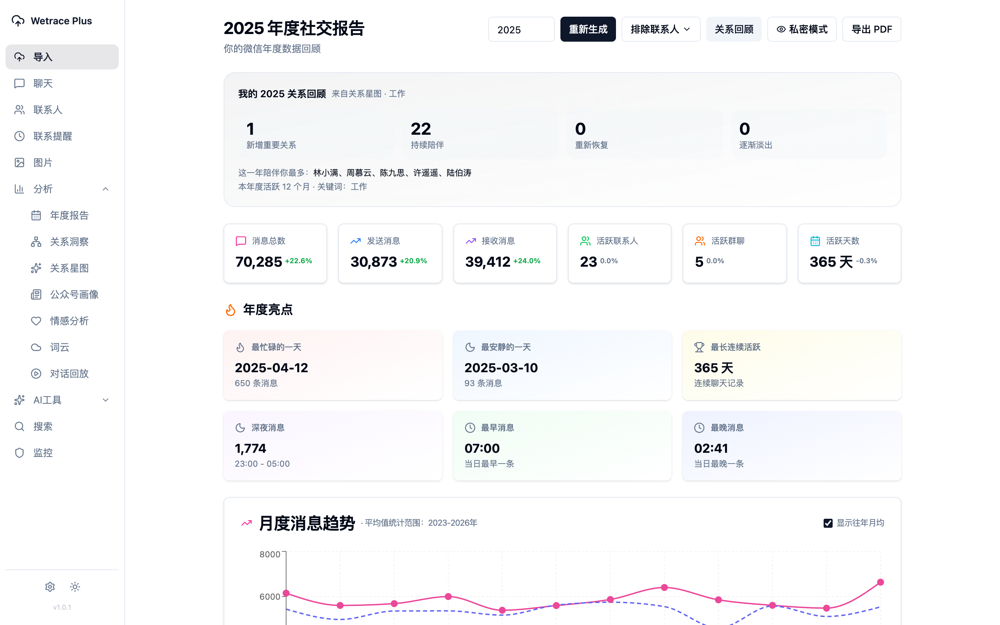

再往下是联系人排行、星期分布、24 小时分布和消息类型分布。

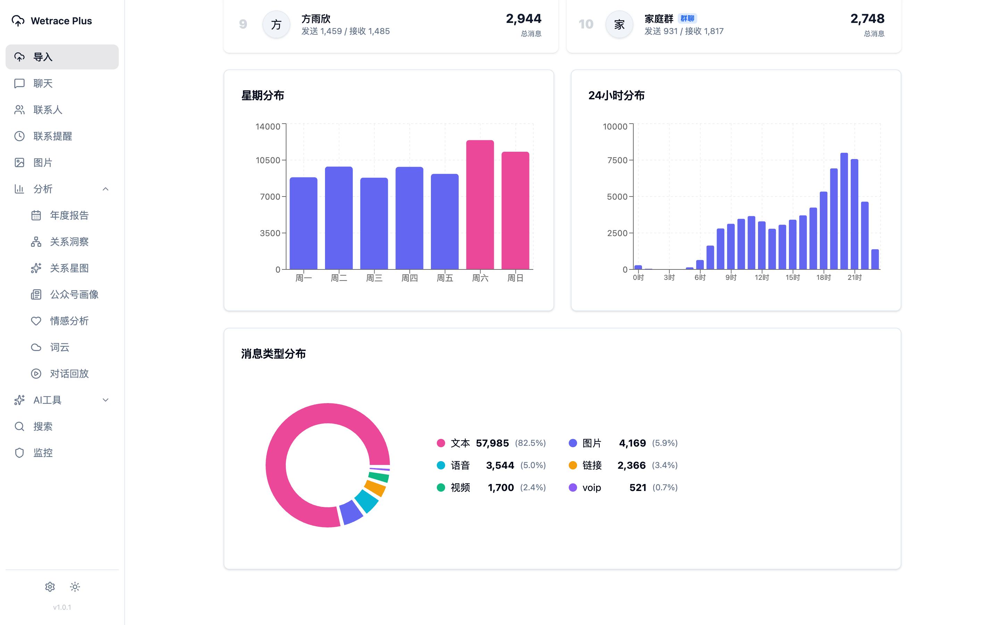

### 关系洞察：谁在靠近，谁在淡出

日历热力图、两个年份的逐项对比、新进入的人与淡出的人，以及每个人的双向互动比（你发 / ta 发、谁更常先开口）。

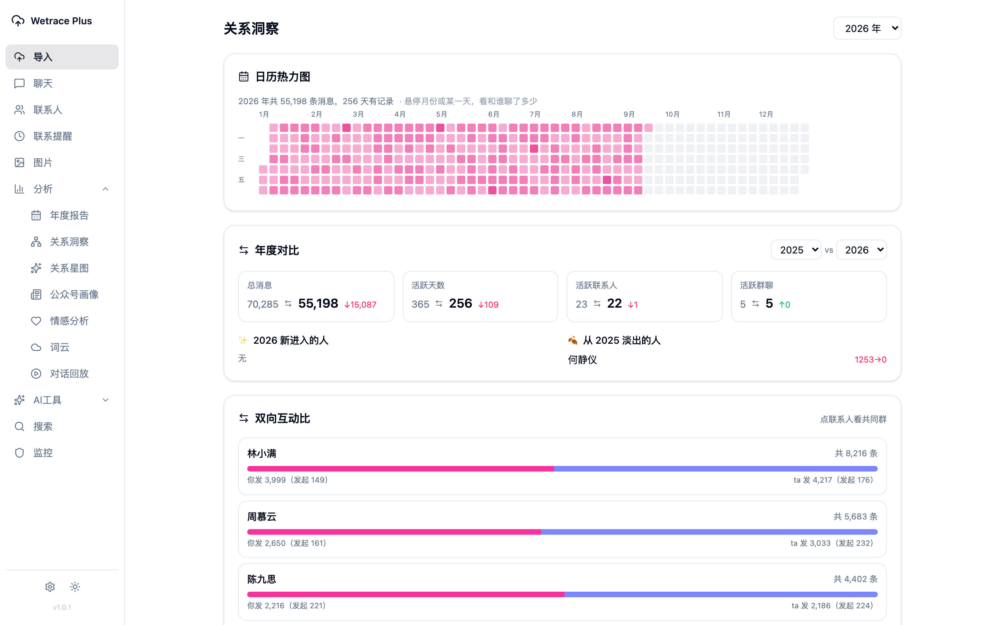

### 关系星图：把通讯录画成一张图

离中心越近越亲密，光晕表示历史深度，亮度表示当前温度；可以按时间段回放关系的变化。
需要先在页面里设置出生年月（用来划分人生阶段）。

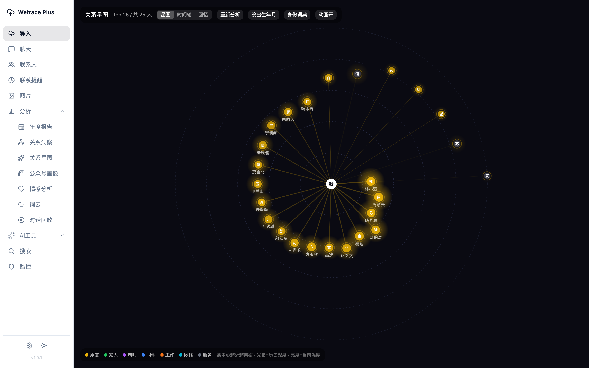

### 公众号画像：谁在轰炸你

订阅号 / 服务号的推送量、月度趋势、推送时段和沉默订阅榜。导入的数据没有独立的公众号消息库，
这里会自动回退到普通消息库，只统计公众号类型的会话。

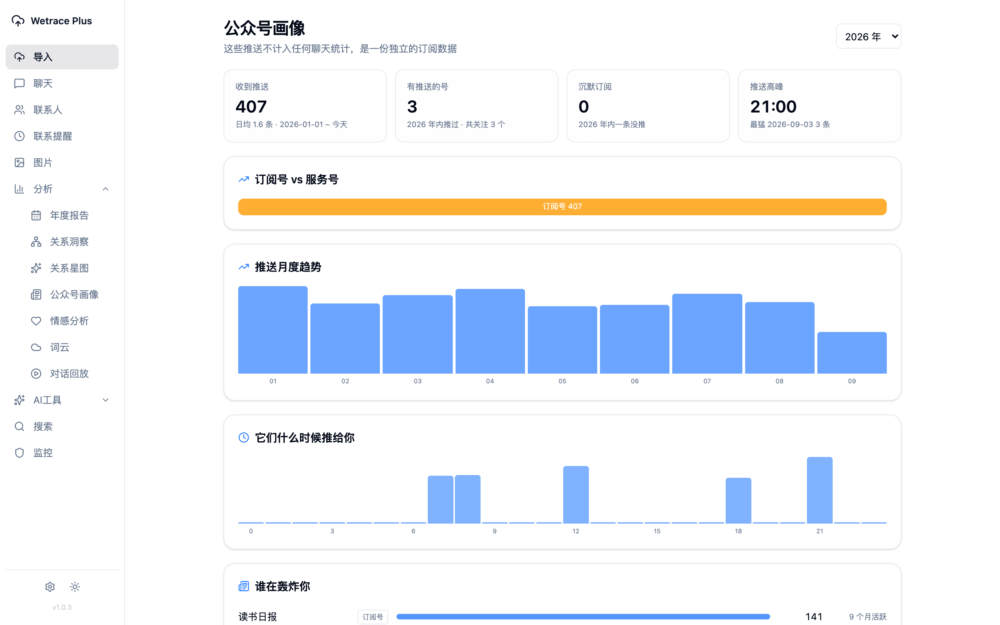

### 词云：这一年你在说什么

支持全局或指定会话、时间范围、词频下限，以及「至少出现在 N 段时间里」的过滤（把偶然刷屏的词滤掉）。

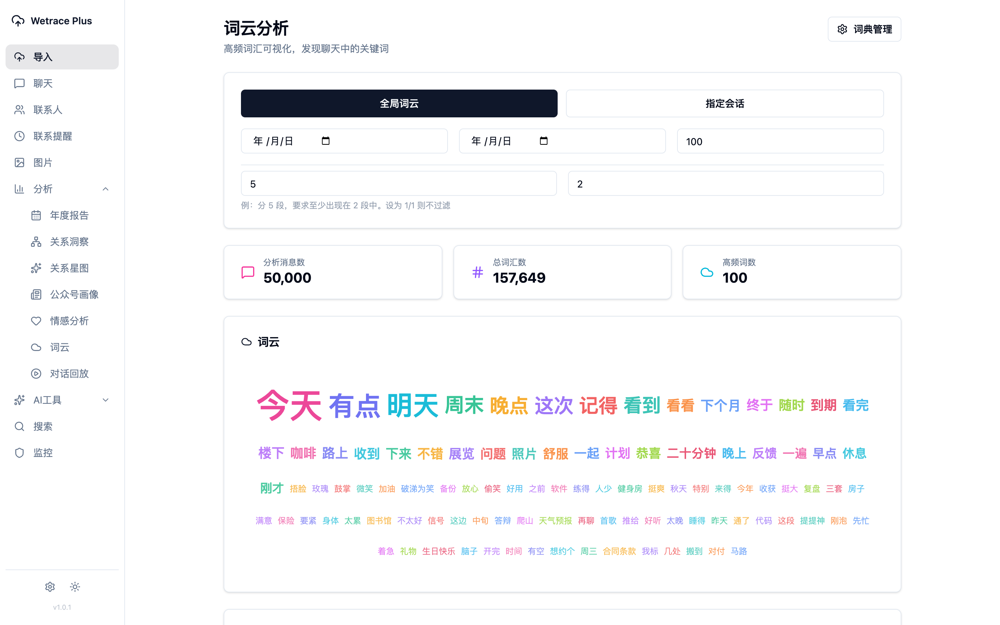

### 对话回放：把聊天当成录像重放

选一个会话，按 1x / 2x / 4x / 8x 播放，消息按原来的节奏一条条浮现。

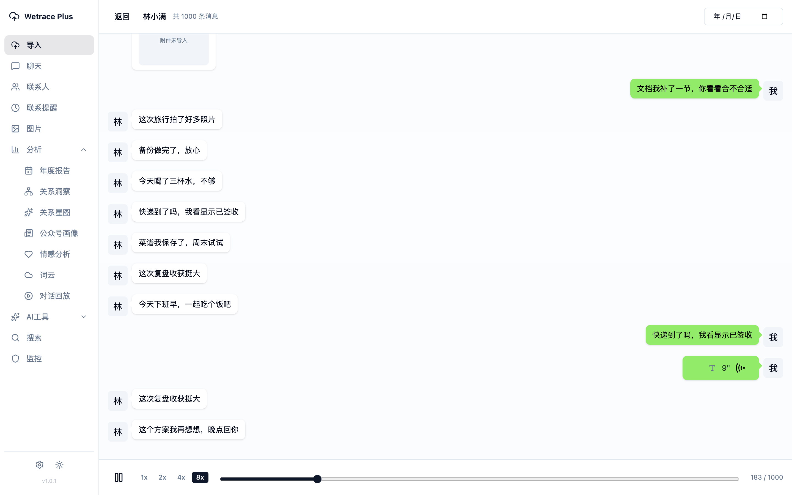

### 全文搜索：跨会话找一句话

关键词高亮，可按会话、时间、类型筛选，点「查看上下文」直接跳回原对话。

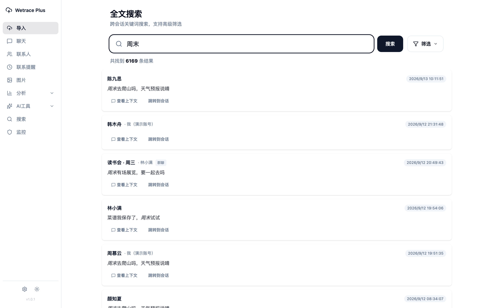

### 联系人：好友、群、公众号分开看

按类型筛选，支持搜索与导出 CSV / XLSX。

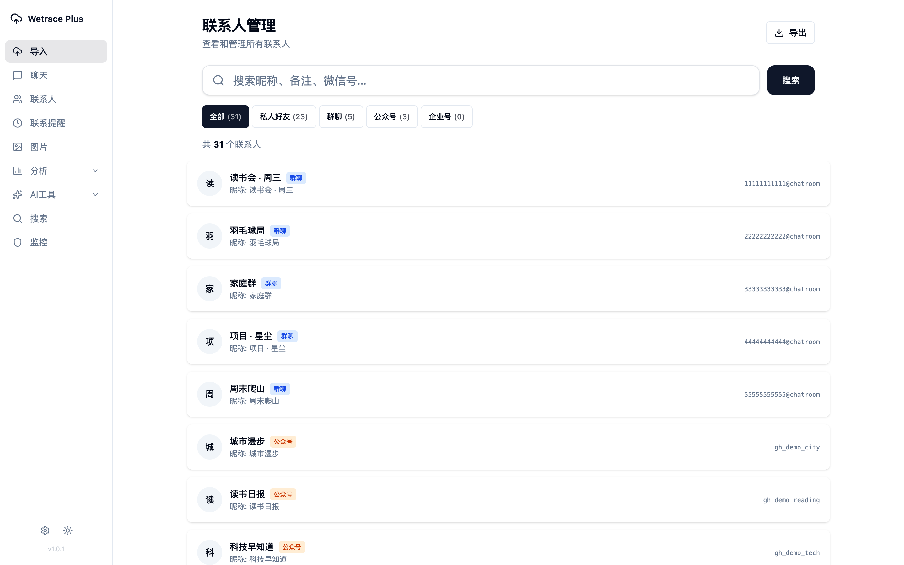

### 联系提醒：多久没联系了

按「超过 N 天未联系」列出需要跟进的人，附最后联系日期。

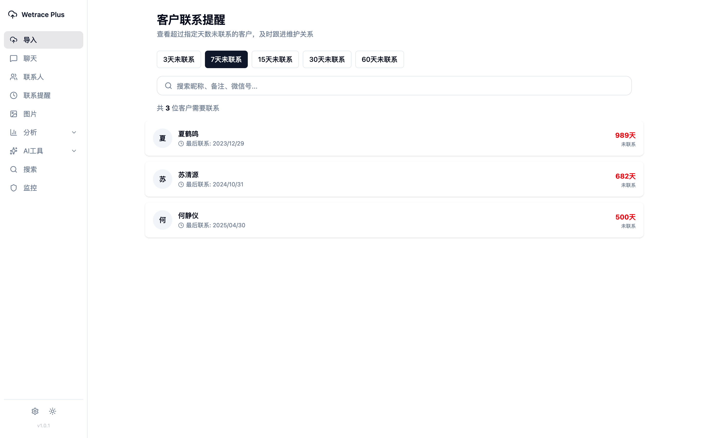

### 设置：一个页面管完

数据目录、时区口径（所有按时间分桶的统计共用同一份配置，出国那几段可以单独设时区段）、
AI 与语音转写、密码保护、移动端配对、备份与监控。

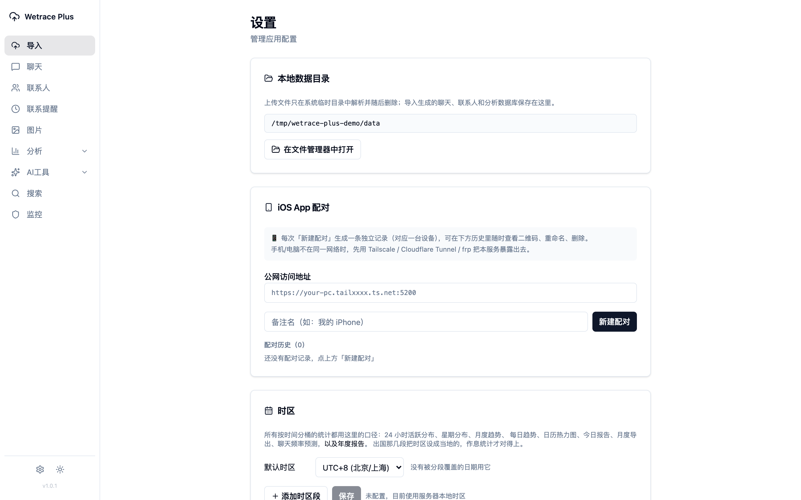

---

## 完整功能清单

| 模块 | 能做什么 |
| --- | --- |
| **导入** | 多文件 / ZIP 拖放；6 种格式自动识别；消息指纹去重；导入历史（文件哈希、格式、条数、告警）；整批事务，任一文件解析失败则全部回滚 |
| **聊天** | 会话列表、消息气泡、按日期跳转、会话内搜索、多格式导出（TXT / CSV / XLSX / DOCX / PDF / HTML 打包） |
| **今日报告** | 当天收发、字数、时段分布、聊得最多排行、与昨天 / 上周同日对比 |
| **会话分析** | 总量与活跃天数、日历热力图、星期与小时分布、消息类型分布、语音条数与时长、通话统计（接通 / 未接通 / 语音 / 视频 / 时长）、互动与回复速度、关键词计数、群成员排行 |
| **年度报告** | 概览与同比、年度亮点、月度趋势（叠加往年均值）、联系人排行、星期 / 小时 / 类型分布、关系回顾、字数口径切换、排除联系人、私密模式、PDF 导出 |
| **关系洞察** | 日历热力图、年度对比、新进入 / 淡出名单、双向互动比、回复速度榜 |
| **关系星图** | 亲密度布局、关系类型与人生阶段、时间轴回放、手动修正与身份词典 |
| **公众号画像** | 订阅号 / 服务号的推送量、活跃月份、时段分布、沉默订阅榜（导入数据没有独立的公众号库，会自动回退到普通消息库） |
| **词云** | 全局 / 单会话、时间范围、词频与分段过滤、自定义词典 |
| **对话回放** | 1x–8x 变速回放、进度跳转、按日期起播 |
| **搜索** | 跨会话全文搜索、高级筛选、上下文跳转 |
| **联系人** | 列表与筛选、导出 CSV / XLSX、联系提醒 |
| **AI（可选）** | 对话摘要、待办与关键信息提取、模拟对话、联系人记忆、情感分析、摘要历史 |
| **语音转文字（可选）** | 本地 Whisper 或兼容接口（前提是导入包里带得到音频） |
| **系统** | 密码保护、移动端只读配对、时区分段配置、备份、敏感词监控与告警、飞书 / 机器人集成、月度统计与取证导出 |

**当前做不到的事**（老实说在前面）：

- 不导入 HTML / TXT / PDF，也不读微信数据库文件本身。
- 图片、语音、视频等**原件**无法还原 —— 目前的导出格式里就没有它们，相关页面只显示占位或元数据。
- 旧式会话 CSV 没有稳定会话 ID 和发送方向时，只能尽力推断（建议填写自己的导出昵称）。

---

## 快速开始

要求 Go 1.25+、Node.js 20+，以及用于编译 `go-sqlite3` 的 C 编译器。

```bash
git clone https://github.com/DrMaomao12345/Wetrace-Plus.git
cd Wetrace-Plus/ui
npm ci
npm run build
cd ..
CGO_ENABLED=1 go run .
```

默认打开 `http://127.0.0.1:5200`，分析库保存在 `WORK_DIR`（默认 `data/`），配置见 [.env.example](.env.example)。

### 方式一：先用演示数据看效果（推荐）

不想先把自己的记录喂进去，可以生成一份完全虚构的数据：

```bash
python3 scripts/gen_demo_import.py --out /tmp/wetrace-plus-demo.json
```

生成的是一个 Wetrace Plus 标准 JSON（约 48 MB、25 万条、跨 4 年），在「导入」页选它即可；
固定随机种子，跑两次结果完全一样。数据刻意做出了层次 —— 晚上是高峰、深夜有睡觉缺口、
周末更多、逐年增长、有人年中才出现、有人聊着聊着淡出、两位「电话党」打了上千次通话 ——
这样每个统计页面都有东西可看。

### 方式二：导入自己的导出文件

1. 用你信任的导出工具生成 JSON / CSV / ZIP。
2. 打开「导入」页选择文件（可多选）。
3. 对缺少发送方向的旧式 CSV，填写自己的导出昵称。
4. 导入完成后，聊天、报告和全部分析页面立即可用。

---

## 已支持的导入格式

| 来源 | 格式 | 识别依据 | 发送方向 |
| --- | --- | --- | --- |
| [chatlog-keeper](https://github.com/labazhou2024/chatlog-keeper) | `wechat_messages.json` | `ts`、`conversation_id`、`sender_wxid`、`is_self`、`msg_type`、`account_id` | 精确 |
| [chatlog](https://github.com/sjzar/chatlog) | JSON | `seq`、`time`、`talker`、`sender`、`isSelf`、`type`、`content` | 精确 |
| chatlog | CSV | `Time,SenderName,Sender,TalkerName,Talker,Content` | 私聊可推断，群聊建议填昵称 |
| MemoTrace / WeChatMsg | 会话 CSV | `消息ID,类型,发送人,时间,内容,...` | 建议填昵称 |
| MemoTrace / WeChatMsg | 全量 CSV | `localId,TalkerId,Type,SubType,IsSender,CreateTime,StrContent,...` | 精确 |
| Wetrace Plus | 标准 JSON v1 | `format: "wetrace-plus"`、`version: 1` | 精确 |
| 以上任一格式 | ZIP | 自动扫描包内 `.json` 与 `.csv` | 同对应格式 |

字段细节、方向判断规则和标准 JSON 示例见 [导入格式说明](docs/13-导入格式.md)。

---

## 统计口径：几条容易错的地方

- **时区决定一条消息属于哪一天。** 所有按时间分桶的统计（24 小时分布、星期分布、月度趋势、日历热力图、
  今日报告、年度报告）都用「设置 → 时区」里那一份配置；没配过时，兜底是**本机时区**而不是 UTC。
  出国那几段可以加时区段，作息统计才对得上。
- **同一个数字在不同页面必须一致。** 年度报告的年度总量和关系洞察「年度对比」里的同一年，用的是同一套
  时区口径，对不上就是口径不一致（曾经真的对不上：年报按 UTC、其它页面按本地）。
- **通话不算「回复」。** 互动统计会剔除通话期间的消息，否则通话里的来回会把平均回复时间压到几秒。
- **「最早 / 最晚一条」以 07:00 为日界**，并且要求前后有 4 小时静默 —— 找的是「起床后第一条」和
  「睡前最后一条」，不是当天字面意义上的最早最晚。
- **去重指纹**由会话 ID、精确时间、发送者、方向、类型、子类型和内容共同计算；同一批或后续批次里的
  相同消息会被跳过，不会重复计入统计。
- **群聊的发送者**写在消息内容前缀里（`wxid:\n正文`），统计时会剥掉再分词，词云里不会混进 wxid。

---

## 项目结构

```
main.go                 入口：加载配置、初始化 Store、启动 Gin，并把 ui/dist 嵌进二进制
internal/importer/      导入适配层：csv.go / json.go 各自负责一种来源，persist.go 统一落库
internal/ai/            可选 AI：摘要、待办提取、模拟对话、联系人记忆
internal/backup/        备份与恢复      internal/monitor/  敏感词监控与告警
internal/forecast/      聊天频率预测    internal/transcripts/ 语音转写结果
store/repo/             所有统计的实现（年度报告、关系星图、词云、通话与语音…）
store/strategy/         数据库路由：按类型找到对应的 SQLite 文件
web/route.go            全部 HTTP 路由   web/api/  各接口的 handler
pkg/util/               VoIP / 时间 / 字符串等纯函数    pkg/wordcloud/  分词与停用词
ui/src/views/           19 个页面（导入、聊天、年度报告、关系星图、词云…）
ui/src/components/      复用组件，analysis/ 下是各种图表
scripts/gen_demo_import.py  生成演示数据
docs/                   17 篇使用文档
```

---

## 文档

| 文档 | 内容 |
| --- | --- |
| [01 项目简介](docs/01-项目简介.md) | 定位与整体结构 |
| [02 安装部署](docs/02-安装部署.md) | 本地运行、Docker、反向代理 |
| [03 配置说明](docs/03-配置说明.md) | `.env` 全部配置项 |
| [04 快速开始](docs/04-快速开始.md) | 第一次导入到出报告，含常见问题 |
| [05 会话与消息](docs/05-会话与消息.md) | 聊天浏览、搜索、导出 |
| [06 联系人管理](docs/06-联系人管理.md) | 联系人、标签、联系提醒 |
| [07 图片画廊](docs/07-图片画廊.md) | 画廊与附件的限制 |
| [08 消息回放](docs/08-消息回放.md) | 对话回放的用法 |
| [09 数据导出](docs/09-数据导出.md) | 多格式导出与标准 JSON |
| [10 年度报告](docs/10-年度报告.md) | 每个指标怎么算的 |
| [11 词云分析](docs/11-词云分析.md) | 分词、停用词、自定义词典 |
| [12 AI 功能](docs/12-AI功能.md) | 模型配置与各项 AI 能力 |
| [13 导入格式](docs/13-导入格式.md) | **兼容矩阵、字段映射、标准 JSON v1** |
| [14 备份](docs/14-备份.md) | 备份与恢复 |
| [15 监控告警](docs/15-监控告警.md) | 敏感词规则与通知 |
| [16 飞书集成](docs/16-飞书集成.md) | 机器人与推送 |
| [17 系统设置](docs/17-系统设置.md) | 时区、密码、移动端配对 |

---

## 开发

```bash
cd ui && npm run dev        # 前端热更新（后端需另起）
CGO_ENABLED=1 go run .      # 后端
go test ./...               # 后端测试
cd ui && npx tsc --noEmit    # 前端类型检查
```

**新增一种导入格式**：适配层在 `internal/importer/`，每个适配器只负责把来源字段转换成统一的 `Message`；
持久化、事务、去重和导入历史由共享写入器处理。新增时请一并提交一份**脱敏后的最小真实样例**与测试，
并更新兼容矩阵（`docs/13-导入格式.md` 与本文件）。

版本号写在根目录 `VERSION`，`npm run sync-version`（prebuild 自动执行）会同步到前端；
改动记录写进 [CHANGELOG.md](CHANGELOG.md)。

---

## 数据与联网说明

- 导入、索引和常规分析**全部在本地完成**。
- 上传的临时文件在一次导入结束后删除，不额外保存副本。
- 只有当你主动启用在线 AI、语音识别、Webhook 或机器人时，相关内容才会发送到你指定的服务商。
- 默认只监听 `127.0.0.1`。想让手机访问，请**先设密码或建移动端配对**再改监听地址 ——
  没有密码时绑非回环地址，等于把全部聊天记录零鉴权挂到局域网上。
- 聊天记录属于高度敏感数据：请只处理你有权使用的内容，并妥善保护导出文件、分析库和备份。

---

## 致谢与免责声明

Wetrace Plus 从 Wetrace Pro 分出，分析框架继承自 [afumu/wetrace](https://github.com/afumu/wetrace)，
并已移除其中的微信进程访问、密钥获取、数据库解密与源目录同步能力。

感谢 [chatlog](https://github.com/sjzar/chatlog)、MemoTrace / WeChatMsg 等社区导出格式，
以及 [go-ego/gse](https://github.com/go-ego/gse)、[Recharts](https://recharts.org/)、
[Gin](https://github.com/gin-gonic/gin) 等开源项目。

本仓库沿用 [CC BY-NC-SA 4.0](LICENSE)（仅覆盖本项目自己新写的部分），第三方依赖各自遵循其许可证。
本项目仅供个人学习与研究，请遵守所在地法律与相关服务条款；使用者对自己处理的数据负全部责任。
